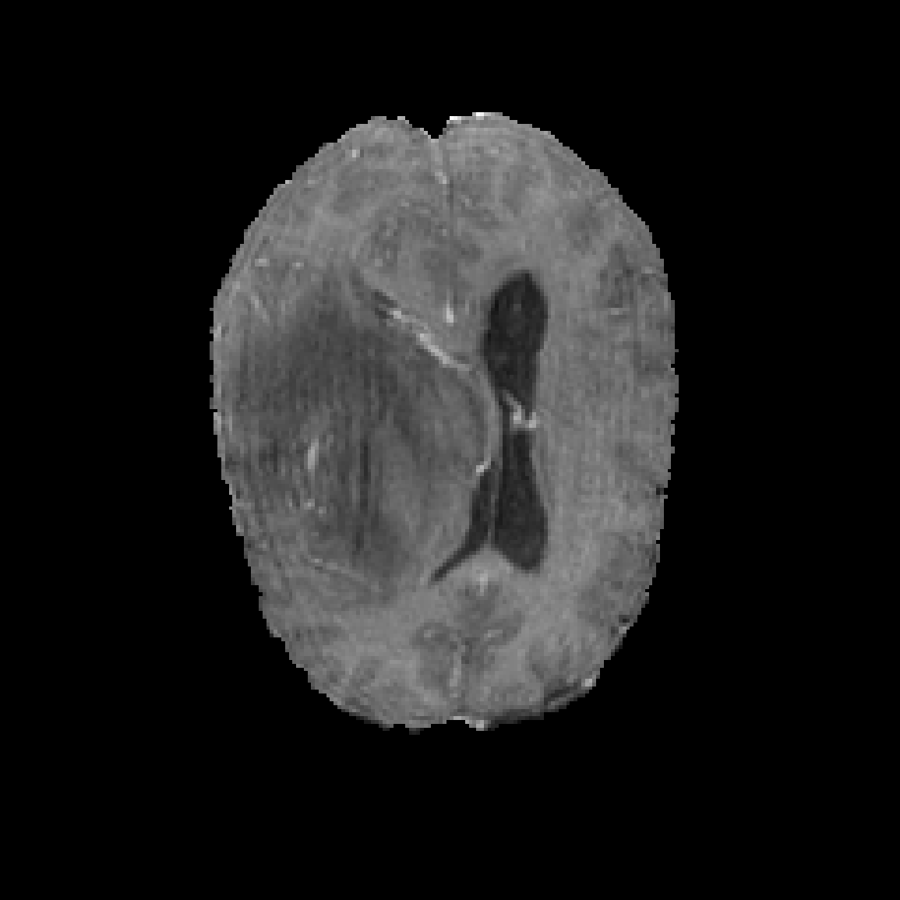
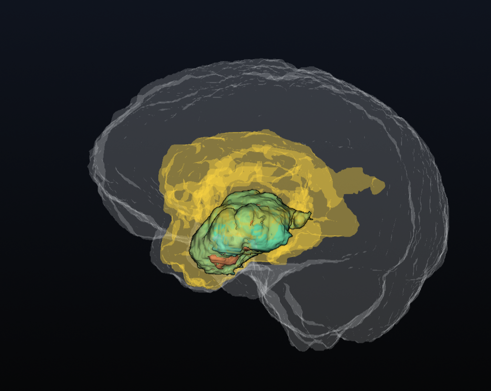

# 🧠 neurovoxel


> **A comprehensive 3D visualization and volumetric analysis tool for BraTS (Brain Tumor Segmentation) datasets, featuring an interactive GUI and 3D U-Net architecture integration.**


*(Above: Interactive 3D visualization of necrotic core, edema, and active tumor regions using Eye Dome Lighting)*

## Overview

**Neuro-Voxel** is a desktop tool for visualizing and analyzing volumetric MRI data (NIfTI). It focuses on converting raw medical scans into interactively manipulatable 3D meshes to assist in examining brain tumor structures.

The project combines standard image processing algorithms (Marching Cubes) with a modern GUI, providing a foundation for both manual inspection and automated segmentation workflows.

## Visual Transformation

**From Raw Data to 3D Insight:**
Neuro-Voxel ingests raw NIfTI slices and reconstructs spatial volumetrics instantly.

| **Input: Raw MRI Slice (T1ce)** | **Output: 3D Segmentation (Neuro-Voxel)** |
| :---: | :---: |
|  |  |
| *Standard 2D Grayscale Input* | *Interactive 3D Volumetric Model* |


## Features

*   **3D Mesh Generation:** Converts voxel masks into smooth 3D surfaces using `scikit-image` (Marching Cubes).
*   **Interactive Interface:** A dark-themed GUI built with **PyQt5** & **PyVista**, supporting layer toggling and opacity control.
*   **Visual Enhancements:** Implements **Eye Dome Lighting (EDL)** to improve depth perception on 3D models.
*   **Volume Calculation:** automatically calculates tumor volume ($cm^3$) using voxel spacing from the file header.
*   **Deep Learning Structure:** Includes a custom **3D U-Net** implementation in PyTorch, designed to handle multi-channel volumetric data (Integration in simulation mode).

## Tech Enviroments

| Component | Library | Usage |
| :--- | :--- | :--- |
| **Language** | Python 3.10+ | Core logic |
| **Visualization** | PyVista (VTK) | 3D Rendering & Mesh manipulation |
| **UI Framework** | PyQt5 | Application window and controls |
| **Data Format** | Nibabel | Reading .nii.gz MRI files |
| **AI Framework** | PyTorch | Model architecture (3D U-Net) |
| **Math** | NumPy | Voxel array manipulation |

## 📂 Project Structure

```bash
neuro-voxel/
├── data/                  # Raw NIfTI datasets (BraTS) - Not included in repo
├── assets/                # Screenshots and Demo GIFs
├── src/
│   ├── ai/
│   │   ├── model.py       # Custom 3D U-Net Architecture (PyTorch)
│   │   └── inference.py   # Inference Engine & Simulation Logic
│   ├── core/
│   │   ├── structure.py   # Dataclasses for Patient Volumes
│   │   └── analyzer.py    # Volumetric Math & Mesh Generation
│   ├── loaders/
│   │   └── brats_loader.py# Robust NIfTI Data Loader
│   └── ui/
│       └── main_window.py # PyQt5 Application Entry Point
├── requirements.txt       # Dependency list
└── README.md              # Documentation
```

## Development Workflow

This project utilizes AI tools to accelerate UI development, allowing focus on core logic and architecture.

*   **Core:** System architecture, 3D U-Net design, volumetric calculations, and medical logic were manually implemented.
*   **UI :** PyQt5 interface layouts and CSS styling were generated using AI (gemini 3.0) assistance.

**Deep Learning Status:**
A custom **3D U-Net** architecture is fully implemented in `src/ai/model.py`. The system currently runs in **Simulation Mode** for inference demonstration, as training on the full BraTS dataset requires HPC resources. The pipeline is designed to be training-ready.

##  Installation & Usage

1.  **Clone the Repository**
    ```bash
    git clone https://github.com/asmarufoglu/neuro-voxel.git
    cd neuro-voxel
    ```

2.  **Create Virtual Environment**
    ```bash
    python -m venv .venv
    # Windows:
    .venv\Scripts\activate
    # Mac/Linux:
    source .venv/bin/activate
    ```

3.  **Install Dependencies**
    *Note: If you experience DLL errors on Windows, avoid the latest nightly builds of PyTorch. Using a stable CUDA version (or CPU-only) is recommended.*

    **Option A: For GPU/CUDA Support (Recommended)**
    ```bash
    pip install torch torchvision torchaudio --index-url https://download.pytorch.org/whl/cu124
    ```

    **Option B: For CPU-Only (Fallback)**
    ```bash
    pip install torch torchvision torchaudio --index-url https://download.pytorch.org/whl/cpu
    ```

    **Install Project Requirements:**
    ```bash
    pip install -r requirements.txt
    ```

4.  **Run the Application**
    ```bash
    python -m src.ui.main_window
    ```

---
## Data Usage & Citations

Data utilized in this project is part of the [Kaggle - BraTS20 Dataset](https://www.kaggle.com/datasets/awsaf49/brats20-dataset-training-validation) challenge. Per the data usage agreement, the following references are cited:

1.  **Menze BH, et al.** "The Multimodal Brain Tumor Image Segmentation Benchmark (BRATS)", IEEE Transactions on Medical Imaging 34(10), 1993-2024 (2015) DOI: 10.1109/TMI.2014.2377694
2.  **Bakas S, et al.** "Advancing The Cancer Genome Atlas glioma MRI collections with expert segmentation labels and radiomic features", Nature Scientific Data, 4:170117 (2017) DOI: 10.1038/sdata.2017.117
3.  **Bakas S, et al.** "Identifying the Best Machine Learning Algorithms for Brain Tumor Segmentation...", arXiv preprint arXiv:1811.02629 (2018)